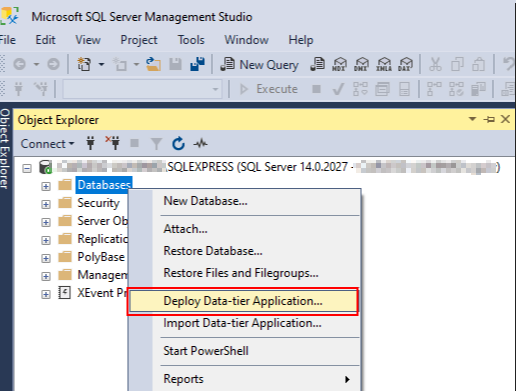
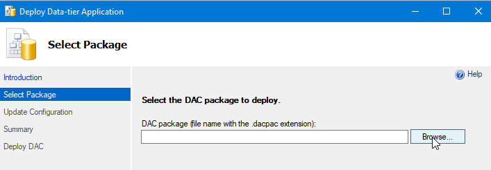
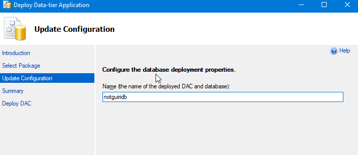
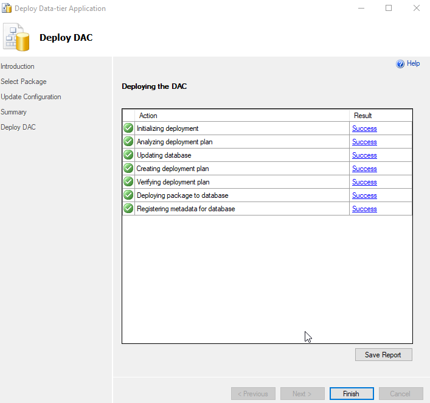
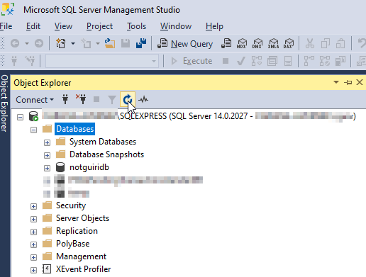

# SETTING UP THE DATABASE

## USING DACPAC DEPLOYMENT:

1. Download the latest notguiridb_XXXX.dacpac file from 'DACPAC' folder and open MS SQL SERVER MANAGEMENT STUDIO and right click in 'Databases'

2. Click in 'Deploy Data-tier Application...'

3. Browse the notguiridb_XXXX.dacpac downloaded file and go to next step

4. If necessary, rename the database to 'notguiridb'

5. Click next and finish

6. Update de databases list and check if it's created correctly the database and its tables

